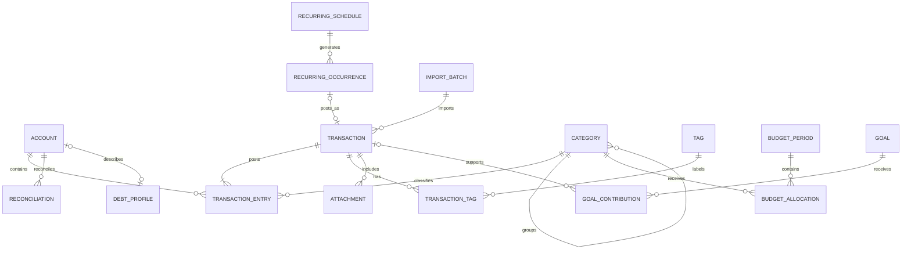

# Northstar — Database Design

## 1. Storage principles

- UUID text primary keys provide stable identities across backup, restore, and import.
- Monetary values use signed `INTEGER` minor units plus currency code.
- UTC instants store audit time; local date stores financial intent.
- Foreign keys are enabled and indexed.
- Financial history is archived or soft-deleted for recovery and local auditability.
- Derived account balances and budget totals are queried, not independently mutable.

## 2. Entity relationship diagram



## 3. Core tables

### accounts

`id PK`, `name`, `type`, `currency_code`, `opening_balance_minor`,
`opening_local_date`, `institution_name`, `color_argb`, `icon_key`, `credit_limit_minor`,
`include_in_net_worth`, `include_in_available_cash`, `sort_order`, `archived_at`,
`created_at`, `updated_at`, `revision`

Indexes: `(archived_at, sort_order)`, `currency_code`.

### transactions

Logical financial operations. A transfer is one transaction with two entries.

`id PK`, `kind`, `local_date`, `occurred_at`, `payee`, `note`, `status`,
`recurring_occurrence_id FK`, `import_batch_id FK`, `import_external_id`,
`created_at`, `updated_at`, `deleted_at`, `revision`

Indexes: `local_date DESC`, `status`, `recurring_occurrence_id`,
`(import_batch_id, import_external_id)` unique when non-null.

### transaction_entries

`id PK`, `transaction_id FK CASCADE`, `account_id FK RESTRICT`,
`category_id FK SET NULL`, `amount_minor`, `currency_code`, `exchange_rate_numerator`,
`exchange_rate_denominator`, `cleared`, `sort_order`

Rules:

- Expense entry is negative; income entry is positive.
- Same-currency transfer entries sum to zero.
- A normal expense/income has one account entry in MVP.
- Split support adds categorized components without changing transaction identity.

Indexes: `(account_id, transaction_id)`, `category_id`, `(account_id, cleared)`.

### categories

`id PK`, `parent_id FK SET NULL`, `kind`, `name`, `icon_key`, `color_argb`,
`sort_order`, `archived_at`, `created_at`, `updated_at`

Unique active category name within `(parent_id, kind)` enforced through validation
and an appropriate normalized index where SQLite behavior permits.

### tags / transaction_tags

Tags: `id PK`, `name`, `color_argb`, `archived_at`.  
Join: `(transaction_id FK, tag_id FK)` composite primary key.

### recurring_schedules

`id PK`, `kind`, `account_id`, `destination_account_id`, `category_id`, `amount_minor`,
`destination_amount_minor`, `currency_code`, `payee`, `note`, `frequency`, `interval`,
`start_local_date`, `end_local_date`, `day_of_month`, `end_of_month`, `next_local_date`,
`reminder_days`, `active`, `created_at`, `updated_at`

Index: `(active, next_local_date)`.

### recurring_occurrences

`id PK`, `schedule_id FK`, `scheduled_local_date`, `state`, `transaction_id FK`,
`effective_amount_minor`, `created_at`, `updated_at`

Unique: `(schedule_id, scheduled_local_date)` prevents duplicate generation.

### budget_periods

`id PK`, `start_local_date`, `end_local_date`, `currency_code`, `created_at`, `updated_at`

Unique: `(start_local_date, currency_code)`.

### budget_allocations

`id PK`, `budget_period_id FK CASCADE`, `category_id FK RESTRICT`, `planned_minor`,
`rollover_mode`, `created_at`, `updated_at`

Unique: `(budget_period_id, category_id)`.

### goals

`id PK`, `name`, `target_minor`, `currency_code`, `target_local_date`,
`linked_account_id FK SET NULL`, `starting_minor`, `priority`, `icon_key`, `color_argb`,
`status`, `created_at`, `updated_at`

### goal_contributions

`id PK`, `goal_id FK CASCADE`, `transaction_id FK SET NULL`, `amount_minor`,
`local_date`, `note`, `created_at`

Index: `(goal_id, local_date)`.

### debt_profiles

`id PK`, `account_id FK UNIQUE`, `original_principal_minor`, `annual_rate_basis_points`,
`minimum_payment_minor`, `due_day`, `term_months`, `compounding_type`, `created_at`,
`updated_at`

### reconciliations

`id PK`, `account_id FK`, `statement_local_date`, `statement_balance_minor`,
`calculated_balance_minor`, `difference_minor`, `adjustment_transaction_id FK`,
`completed_at`

Index: `(account_id, statement_local_date DESC)`.

### receipt_attachments

`id PK`, `transaction_id FK CASCADE`, `content BLOB`, `original_name`, `mime_type`,
`byte_size`, `created_at`, `ocr_status`, `ocr_text`, `detected_amount_minor`,
`detected_currency_code`, `detected_local_date`, `detected_merchant`.

### transaction_exchange_rates

`id PK`, `transaction_id FK CASCADE`, `entry_id FK CASCADE UNIQUE`,
`base_currency_code`, `quote_currency_code`, `rate_micros`,
`converted_amount_minor`, `rate_local_date`, `source`, `status`, `fetched_at`.

### import_batches

`id PK`, `source_name`, `content_hash`, `started_at`, `completed_at`, `status`,
`row_count`, `imported_count`, `skipped_count`, `error_count`.

## 4. Preferences outside Room

Proto DataStore contains theme, locale override, month start, privacy display settings,
notification preferences, onboarding completion, and backup reminder metadata. It
does not contain balances, transactions, budgets, or secrets.

## 5. Example records

```text
account: id=A1, name=Main Account, type=CHECKING, currency=EUR, opening=125000
transaction: id=T1, kind=EXPENSE, date=2026-07-16, payee=Continente
entry: id=E1, transaction=T1, account=A1, category=C_GROCERIES, amount=-4250, currency=EUR
budget: July 2026 / Groceries, planned=40000
goal: Emergency Fund, target=600000, current contributions=175000
```

This represents €1,250.00 opening balance, a €42.50 expense, a €400 grocery plan,
and a €6,000 goal with €1,750 contributed.

## 6. Normalization and scalability

The schema is in practical third normal form: accounts, categories, tags, schedules,
and goals are independent; many-to-many relationships use joins; derived totals are
not duplicated. Selective denormalization is allowed only after profiling and must
include transactional invalidation rules.

Stable identifiers, timestamps, and soft deletion support safe local recovery and
portable backups. Large transaction lists use indexed date/account queries and Paging
when measurement justifies it.

## 7. Migration policy

- Export Room schema JSON for every version.
- Test every supported migration path with fixtures.
- Never use destructive migration in production.
- Back up before high-risk migration when possible.
- Add nullable/defaulted columns before making constraints stricter.
- Treat money representation and transfer invariants as migration-critical.
